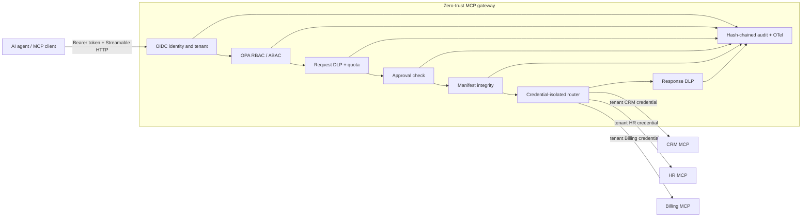

# Zero-Trust, Multi-Tenant MCP Security Gateway

A protocol-aware security gateway and control plane for AI agents using the Model Context Protocol (MCP). It verifies identity, limits tool discovery, evaluates every call with OPA, keeps tenant credentials separate, scans data in both directions, requires human approval for high-risk actions, detects tool drift, and emits tamper-evident audit records.

This repository is a working security reference project, not a claim that the included development identity provider or synthetic services are production infrastructure.

## What is implemented

| Capability | Status | Evidence |
|---|---|---|
| MCP discovery and tool calls over Streamable HTTP | Implemented | `/mcp`, live integration test |
| CRM, HR, and Billing upstream MCP servers | Implemented | `synthetic-servers/` |
| Verified tenant identity and token audience | Implemented | OIDC/JWKS verifier; signed development issuer |
| Deny-by-default RBAC/ABAC | Implemented | OPA Rego policy |
| Least-privilege `tools/list` | Implemented | unauthorized tools are omitted |
| Separate downstream credentials | Implemented | gateway token is never forwarded upstream |
| Request and response DLP | Implemented | secrets blocked outbound; PII/secrets redacted inbound |
| Per-principal, per-tool rate limits | Implemented | stricter high-risk limit |
| Human approval | Implemented | tenant-bound, exact-request, expiring, single-use approvals |
| Tool manifest integrity | Implemented | schema hash pinning, drift quarantine, suspicious-description checks |
| Tamper-evident audit | Implemented | append-only JSONL SHA-256 chain; argument hashes only |
| OpenTelemetry and metrics | Implemented | security spans and Prometheus-style counters |
| Network/process isolation | Implemented for local Compose | internal upstream network, loopback publishing, read-only containers, no capabilities |
| Security tests and benchmark | Implemented | unit, adversarial live flow, and reproducible benchmark |

Kubernetes is intentionally outside the current scope. Local control state uses SQLite and JSONL; production multi-replica deployments should replace those stores with a transactional shared database and durable append-only audit sink.

## Architecture



The gateway derives tenant identity only from a verified access token. User-supplied `tenant_id` values do not select credentials or authorization scope. An authenticated gateway token is also never reused against an upstream resource.

See [architecture](docs/architecture.md), [threat model](docs/threat-model.md), [security deployment notes](docs/security.md), and the [end-goal audit](docs/end-goal-audit.md).

## Run the complete stack

Prerequisites: Docker Desktop with Compose v2 and PowerShell.

```powershell
.\run-servers.ps1
```

The script builds the images, starts OPA, the three upstreams, the gateway, and the dashboard, then waits for security readiness.

- Dashboard: `http://127.0.0.1:5173`
- Gateway readiness: `http://127.0.0.1:8000/ready`
- MCP endpoint: `http://127.0.0.1:8000/mcp`
- OPA: `http://127.0.0.1:8181`

Run the assertion-based demonstration:

```powershell
python -m venv .venv
.\.venv\Scripts\python.exe -m pip install -r requirements-dev.txt
.\.venv\Scripts\python.exe test_client.py
```

It proves role-filtered discovery, an authorized CRM read, response redaction, cross-tenant denial, an approved HR read, approval replay denial, and a secret-free audit export. See [demo guide](docs/demo.md).

Stop the services without deleting persistent gateway state:

```powershell
.\stop-servers.ps1
```

## Authorization model

| Role | Discoverable tools | Call behavior |
|---|---|---|
| `crm-viewer` | `crm_get_client` | allowed for the authenticated tenant |
| `hr-viewer` | `hr_get_salary` | human approval required |
| `finance-viewer` | `billing_get_invoice` | reads allowed; delete hidden and denied |
| `finance-admin` | billing read and delete | delete requires human approval |
| `admin` | all tools | high-risk and critical tools still require approval |
| `approver` | control-plane role | may approve requests only in its own tenant |
| `auditor` | control-plane role | may read audit events only for its own tenant |

OPA receives the verified principal, agent, action, tool metadata, resource, tenant, and approval context. Missing or invalid policy responses and policy-engine outages deny the call.

## Test and verify

```powershell
# Unit and adversarial component tests
.\.venv\Scripts\python.exe -m pytest -m "not integration"

# Docker-backed Streamable HTTP security flow
$env:GATEWAY_TEST_BASE_URL = "http://127.0.0.1:8000"
.\.venv\Scripts\python.exe -m pytest -m integration

# Frontend static checks
Push-Location frontend
npm ci
npm run lint
npm run build
Pop-Location

# Compose validation
docker compose config -q
```

CI repeats the unit/build gates and the full live-stack test. See [benchmark results and reproduction](docs/benchmark.md).

## Production configuration

Copy `.env.example` into your deployment secret/config system; do not commit a populated `.env`. Production startup refuses:

- the development token issuer;
- a non-HTTPS public URL, issuer, or JWKS endpoint;
- symmetric OIDC signing algorithms;
- missing JWKS configuration; and
- development or placeholder downstream credentials.

Terminate TLS at a trusted ingress, supply real resource-specific credentials from a secret manager, restrict the control plane and metrics endpoint to operators, and use a durable shared approval/audit backend before running multiple replicas. The complete checklist is in [docs/security.md](docs/security.md).

## Repository map

```text
backend/             gateway, identity, policy, DLP, audit, approvals, routing
policy/              deny-by-default OPA policy
synthetic-servers/   tenant-isolated CRM, HR, and Billing MCP servers
manifests/           reviewed upstream tool-schema baselines
frontend/            React operator dashboard
tests/               unit and live security tests
scripts/             manifest approval and benchmark tools
docs/                architecture, threat model, security, demo, benchmarks
```
