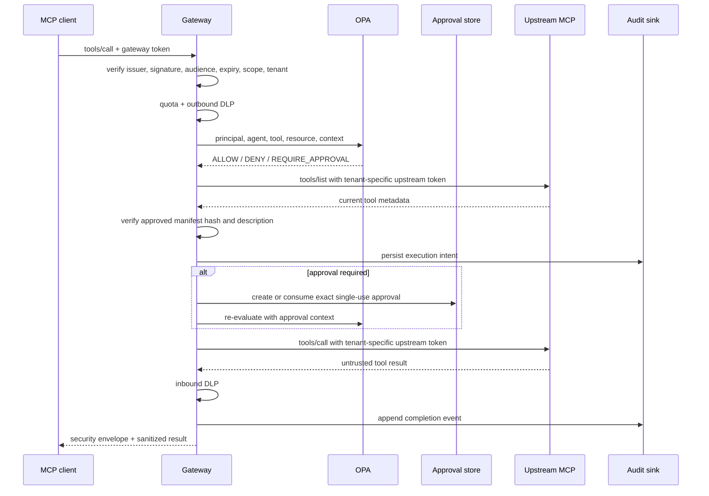

# Architecture

## System boundaries

The gateway is both an MCP server and a security enforcement point. Clients use MCP Streamable HTTP at `/mcp`; operators use authenticated `/v1/*` control-plane endpoints. CRM, HR, and Billing are independent MCP servers reachable only on the Compose-internal `mcp_backplane` network.

There are four trust boundaries:

1. The client-to-gateway boundary authenticates a token specifically intended for the gateway.
2. The gateway-to-OPA boundary obtains a deny-by-default authorization decision.
3. The gateway-to-upstream boundary uses a separate credential selected from the verified tenant and fixed upstream name.
4. The upstream-response boundary scans untrusted tool output before returning it to the client.

## Tool discovery

For every catalogued tool, the gateway sends a `list_tools` decision request to OPA. Only tools receiving `ALLOW` are included in the MCP response. This prevents a client or model from learning about actions it is not entitled to invoke. Discovery is audited with identity and count, not the access token.

## Tool-call sequence

All checks are repeated per call; no authorization decision relies on transport-session state.

## Fail-closed behavior

- Invalid or missing identity: MCP authentication fails.
- OPA unreachable or malformed decision: `DENY`.
- Unknown tool: `DENY`.
- Missing tenant credential or non-allowlisted destination: upstream call is rejected.
- Manifest mismatch or suspicious description: upstream is quarantined.
- Invalid audit hash chain: execution is rejected before the upstream call.
- Execution-intent audit write failure: execution is rejected before the upstream call.
- Completion audit failure: the client receives a denial while the already-written intent remains for investigation.

## State

- `manifests/approved.json` is a reviewed baseline copied into the runtime state volume.
- Approvals use SQLite with exact argument hashes, expiry, status, and one-time consumption.
- Audit uses append-only JSONL records linked by SHA-256 hashes.

These stores make the local demonstration reproducible. They are deliberately not presented as a multi-node production data layer; use a transactional shared database and durable append-only/WORM-capable log sink for that deployment model.

## Observability

The gateway creates OpenTelemetry spans for MCP calls using tool, tenant, and agent identifiers only. `/metrics` exposes request, decision, result, latency-sum, redaction, and audit-failure counters. Raw arguments, tool results, bearer tokens, and downstream credentials are excluded.
